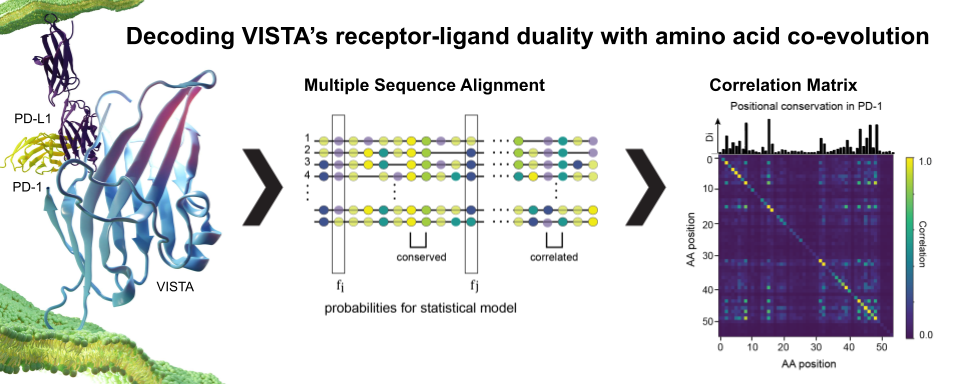

# Statistical Coupling Analysis for the V-set Protein Family
## Table of Contents
1. Introduction
2. Installing dependencies
3. Multiple sequence alignment
4. Generate the correlation matrix

## Introduction

The raw data at the heart of our project is a single binary database file.
This file contains a multiple sequence alignment of thousands of proteins.
Each protein sequence belongs to the V-set protein family and
is annotated with phylogenetic metadata.
While this dataset can be easily accessed via the PFam database website,
we have included the processes database file here for ease of use.

> https://pfam.xfam.org/family/V-set

In order to run these calculations, we will need to install some dependencies.
For a clean set up, we recommend using brew on MacOS.
Similar commands can be used for Linux and windows.

## Installation
1. Install matplotlib
> conda install -c conda-forge matplotlib

2. Install scipy
> conda install -c anaconda scipy

3. Install pysca
>

import os
import time
import matplotlib.pyplot as plt
import math
import numpy as np
import copy
import scipy.cluster.hierarchy as sch
from scipy.stats import scoreatpercentile
from pysca import scaTools as sca
import colorsys
# import mpld3
import pickle as pickle
from optparse import OptionParser

## Generating the Summary Histogram and Heatmap
