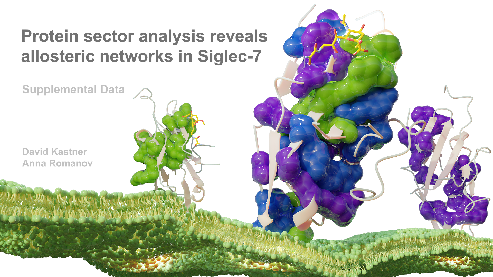

---

# Statistical Coupling Analysis
## Table of Contents
1. **Overview**
    * Introduction
    * Raw data description
2. **Installation**
    * Folder structure
    * Installing dependencies
3. **Multiple sequence alignment**
    * Alignment protocols
    * Processing
    * Core calculations
5. **Generate Analysis**
    * _data_analysis.py_

## I. Overview
### Introduction
The purpose of these repo is to facilitate running statistical coupling analysis for the V-set family proteins.
Specifically, the project is looking at amino acid co-evolution in human siglecs.
The repo starts from raw structural and sequence data and generates a multiple sequence alignment based on the sequence of Siglec-7.
The alignment is then processed to extract evolutional information to find domains under unique selectional pressure.
The pySCA code is written and maintained by the Ranganathan Lab and is used extensively throughout the analysis (1,2).
It is beautifully documented here:  
https://ranganathanlab.gitlab.io/pySCA/

### Raw data description

#### Custom MSA
The multiple sequence alignment was generated using PSI-BLAST, with the sequence of the siglec-7 crystal structure used as the query (PDB:1O7V).
To increase the accuracy and prevent false hits, we set the e-value threshold to 1E-7 and a word size of two in both iterations. 
A total of 9552 sequences were retrieved from the non-redundant (nr) database. For phylogenetic annotation, we wrote a script to parse the accession 
numbers from the text file (can be found in the _Scripts_ directory). We used the 'ncbi' option in annotateMSA which uses the Biopython NCBI Entrez utility
to look up taxonomic information.

#### PFAM Analysis
This file contains a multiple sequence alignment generated from 73,704 V-set sequences.
Using the pySCA API, the multiple sequence alignment has been enhanced to include phylogenetic metadata.
This dataset can be easily accessed via the PFam database website.
The annotation step is computationally expensive can take up to 7 hours to download and annotate.
For the original multiple sequence alignment data visit the following site and select _Generate_:  
https://pfam.xfam.org/family/V-set#tabview=tab3

## II. Installation
### Folder structure
The repo is divided into three key directories: _Data_, _Figures_, and _Scripts_.
The _Data_ directory contains three sub folders _Alignments_, _Fasta_, and _Structures_.
_Alignments_ contains all six of the multiple sequence alignments we used in the paper.
_Fasta_ contains the original psi-blast file and _Structures_ contains the final PyMol files to vizualize the sectors.
The _Figures_ directory contains is where any output figures will be saved.
The _Scripts_ directory contains our full python script called _data_analysis_ that interacts with the processed alignment file.
It also contains the R script that was used to perform the Decipher multiple sequence alignment.
The script called _data_analysis_ currently will generated a single figure.

### Installing dependencies
In order to run these calculations, we will need to install some dependencies.
First, we will need to install the core dependencies which include the latest versions of Python and GCC.
The Ranganathan Lab has included a beautiful tutorial with the pySCA distribution.
Completing the Ranganathan Lab pySCA installation tutorial will automatically install several other dependencies, including:
numpy, scipy, argparse, wheel, and matplotlib.
You can use a package manager like homebrew to keep the installation clean.
The installation is summarized below as a supplement to the Ranganathan tutorial.
However, make sure to refer to the original tutorial for system specific details details:
https://ranganathanlab.gitlab.io/pySCA/install/

1. Core system dependencies
    > xcode-select --install  
    > brew install python3  
    > brew install gcc  

2. Fasta36
    > git clone https://github.com/wrpearson/fasta36.git  
    > cd fasta36/src  
    > make -j2 -f ../make/Makefile.os_x86_64 all  
    > cp -r ../bin /usr/local  
    > rm /usr/local/bin/README  
    > cd ../..  

3. pySCA
    > git clone https://github.com/ranganathanlab/pySCA.git  
    > cd pySCA-master  
    > pip install .  

4. The pySCA distribution automatically installs the latest compatible versions of the following packages:
    * numpy
    * scipy
    * argparse
    * wheel
    * matplotlib

## III. Custom Multiple Sequence Alignment

Add all three files to the pySCA directory at ./pySCA-master/data/.
Run the following commands from the terminal to process the annotated MSA file.
These commands create the same .db file that we have provided.
For benchmarking purposes, you should know that the first line is the most computationally expensive.
It can take several hours. The following three should take less than 10 minutes.

> annotateMSA -i ../data/PF07686_full.txt -o ../data/PF07686_full.an -a 'pfam' -p ./data/pfamseq.txt  
> scaProcessMSA -a ../data/PF07686_full.an -b ../data/ -s 3BIK -c B -f 'Homo sapiens' -t -n  
> scaCore -i ../output/PF07686_full.db  
> scaSectorID -i ../output/PF07686_full.db  

## IV. Generating the correlation matrix

Download the _domain-clusters_ repository.
Inside the scripts directory of the _domain-clusters_ Github repository,
you will find a python script.
It takes a single file as input, the provided .db file, and outputs the figure.
With pySCA and dependencies successfully installed,
this script will create a histogram of all pairwise interactions within the dataset.
It will also generate a correlation matrix, which shows which sequences within the MSA are correlated.
Due to the size of the database file, this script can take 15 minutes to complete.
When it completes, the figure will be placed automatically in the Figures directory.
For reference, an example of the figure has been provided in the Figures directory.
It is called "fig1_example.png."

> git clone https://github.com/davidkastner/siglec-sca.git  
> cd domain-clusters/Scripts  
> python data_analysis.py  

## Citations
1. Rivoire, O., et al. Evolution-Based Functional Decomposition of Proteins. (2016)
2. Halabi, N., et al. Protein sectors: evolutionary units of three-dimensional structure. Cell. 138, (2009)
3. Salinas, V., et al. Coevolution-based inference of amino acid interactions underlying protein function (2018)
